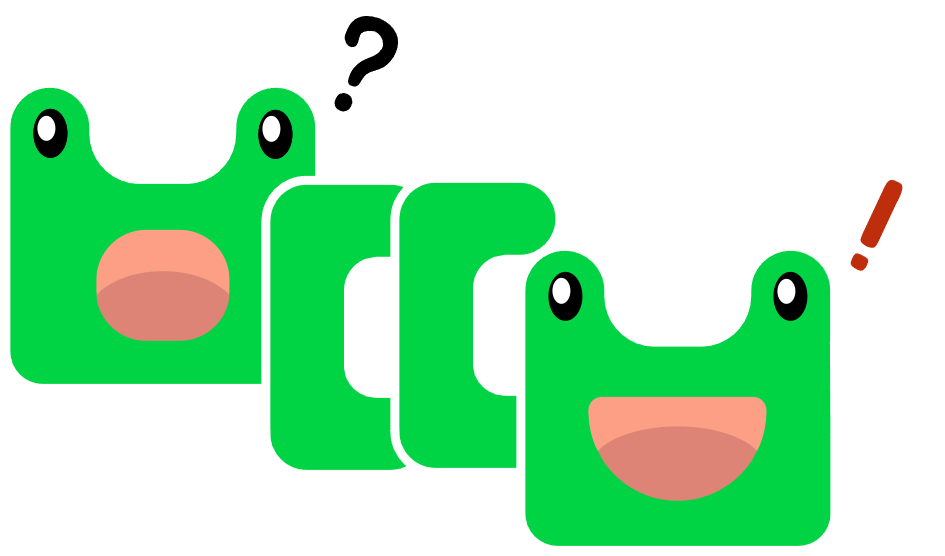

# 🚀 woowacourse-projects

    

> [우아한테크코스](https://woowacourse.github.io/) 3기에서 학습한 내용을 정리하는 저장소

  

## 🐓 레벨4: 2021.09 ~ 현재
|Project |Repository |Pull Request |
|:------:|:---------:|:-----------:|
|HTTP 서버 구현하기|[jwp-dashboard-http/ggyool](https://github.com/ggyool/jwp-dashboard-http/tree/ggyool)|[step1](https://github.com/woowacourse/jwp-dashboard-http/pull/25), [step2](https://github.com/woowacourse/jwp-dashboard-http/pull/107)
|MVC 구현하기|[jwp-dashboard-mvc/ggyool](https://github.com/ggyool/jwp-dashboard-mvc/tree/ggyool)|[step1](https://github.com/woowacourse/jwp-dashboard-mvc/pull/53), [step2](https://github.com/woowacourse/jwp-dashboard-mvc/pull/99)
|JDBC 라이브러리 구현하기|[jwp-dashboard-jdbc/ggyool](https://github.com/woowacourse/jwp-dashboard-jdbc/tree/ggyool)|[step1,2](https://github.com/woowacourse/jwp-dashboard-jdbc/pull/24)

  

## 🐥 레벨3: 2021.06 ~ 2021.08
### 팀 프로젝트
### 보고 또 보고 - 웹 개발자의 면접을 도와주는 서비스 입니다.

    

#### [develop server](https://botobo.r-e.kr/) / [api 명세서](https://botobo.r-e.kr/api/docs/index.html) / [repository](https://github.com/woowacourse-teams/2021-botobo) / [wiki](https://github.com/woowacourse-teams/2021-botobo/wiki)

  

## 🐣 레벨2: 2021.04 ~ 2021.05
Spring Core, Spring MVC, Spring JDBC, 배포 인프라

### ✍🏻 [레벨2 학습로그 모음](./log/level2.md)

### 진행 미션
|Project |Repository |Pull Request |
|:------:|:---------:|:-----------:|
|체스(spring)|[jwp-chess/ggyool](https://github.com/woowacourse/jwp-chess/tree/ggyool)|[step1](https://github.com/woowacourse/jwp-chess/pull/266), [step2](https://github.com/woowacourse/jwp-chess/pull/323)
|지하철 노선도 관리|[atdd-subway-map/ggyool](https://github.com/woowacourse/atdd-subway-map/tree/ggyool)|[step1](https://github.com/woowacourse/atdd-subway-map/pull/73), [step2](https://github.com/woowacourse/atdd-subway-map/pull/151)
|지하철 경로 조회|[atdd-subway-path/ggyool](https://github.com/woowacourse/atdd-subway-path/tree/ggyool)|[step1](https://github.com/woowacourse/atdd-subway-path/pull/78), [step2](https://github.com/woowacourse/atdd-subway-path/pull/155)
|지하철 협업|[atdd-subway-fare/ggyool](https://github.com/woowacourse/atdd-subway-fare/tree/ggyool)|[PR](https://github.com/woowacourse/atdd-subway-fare/pull/51)

  

## 🥚 레벨1: 2021.02 ~ 2021.03
JAVA, TDD, OOP, Web Basic, DB Basic

### ✍🏻 [레벨1 학습로그 모음](./log/level1.md)

### 진행 미션
|Project |Repository |Pull Request |
|:------:|:---------:|:-----------:|
|자동차 경주 게임|[java-racingcar/ggyool](https://github.com/woowacourse/java-racingcar/tree/ggyool)|[step1](https://github.com/woowacourse/java-racingcar/pull/185), [step2](https://github.com/woowacourse/java-racingcar/pull/255)
|로또|[java-lotto/ggyool](https://github.com/woowacourse/java-lotto/tree/ggyool)|[step1](https://github.com/woowacourse/java-lotto/pull/257), [step2](https://github.com/woowacourse/java-lotto/pull/313)
|블랙잭|[java-blackjack/ggyool](https://github.com/woowacourse/java-blackjack/tree/ggyool)|[step1](https://github.com/woowacourse/java-blackjack/pull/128), [step2](https://github.com/woowacourse/java-blackjack/pull/215)
|체스(spark)|[java-chess/ggyool](https://github.com/woowacourse/java-chess/tree/ggyool)|[step1](https://github.com/woowacourse/java-chess/pull/205), [step2](https://github.com/woowacourse/java-chess/pull/266)
|투두리스트(js)|[js-todo-list-step1/ggyool](https://github.com/ggyool/js-todo-list-step1/tree/ggyool)|[PR](https://github.com/woowacourse/js-todo-list-step1/pull/17)

  

## 📝 글쓰기 과정
|Topic|Repository |Pull Request |
|:----------------------:|:---------:|:-----------:|
|우아한테크코스 한 달 생활기|[level1.md](https://github.com/ggyool/woowa-writing-3/blob/ggyool/level1.md)|[PR](https://github.com/woowacourse/woowa-writing-3/pull/68)
|우테코에서 찾은 나만의 효과적인 공부법|[level2.md](https://github.com/ggyool/woowa-writing-3/blob/ggyool/level2.md)|[PR](https://github.com/woowacourse/woowa-writing-3/pull/159)
|팀 프로젝트가 나에게 남긴 것|[level3.md](https://github.com/ggyool/woowa-writing-3/blob/ggyool/level3.md)|[PR](https://github.com/woowacourse/woowa-writing-3/pull/226)

 
